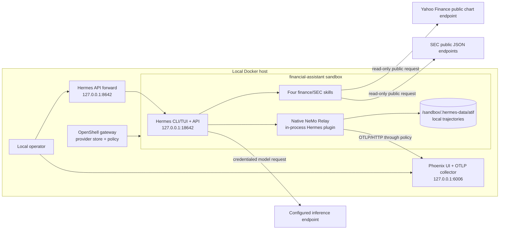

<!--
  SPDX-FileCopyrightText: Copyright (c) 2026 NVIDIA CORPORATION & AFFILIATES. All rights reserved.
  SPDX-License-Identifier: Apache-2.0
-->

# Financial Assistant: Hermes + NemoClaw

This NVIDIA-maintained recipe runs a focused public-market research assistant
with Hermes inside a NemoClaw-managed OpenShell sandbox. It combines public
quote snapshots and SEC company facts into concise research briefs while
keeping facts, interpretation, and follow-up checks separate.

The operator uses Hermes directly through its terminal interface or
OpenAI-compatible API. This recipe does not add a public web interface,
Outlook integration, brokerage or portfolio access, trade execution, or remote
trace storage.

This is an educational research recipe. It does not provide personalized
investment, legal, accounting, or tax advice. Public data can be delayed,
incomplete, unavailable, or wrong. Verify important conclusions against the
original filing or a licensed market-data source before acting.

## What the recipe owns

- One `financial-assistant` Linux sandbox on a Docker-capable host.
- A checksum-pinned Hermes `0.20.0` runtime with Hermes's native NeMo Relay
  integration and NeMo Relay `0.7.2`.
- Four small finance and SEC skills that use Python's standard library.
- A loopback-only Hermes API forward at `http://127.0.0.1:8642`.
- Phoenix `17.13.0` at `http://127.0.0.1:6006`, with state in the local
  `phoenix-data` Docker volume.
- Local Agent Trajectory Interchange Format (ATIF) records under
  `/sandbox/.hermes-data/atif`, written or refreshed after completed Hermes
  turns.
- Setup, verification, trace download, and teardown scripts for this recipe.

The recipe does not operate Yahoo Finance, SEC EDGAR, the NVIDIA inference
service, Hermes, NeMo Relay, OpenShell, or Phoenix. It does not promise the
availability, accuracy, licensing, retention, or support policy of those
third-party services and projects.

## Architecture and boundaries



The host forwards the Hermes API only on `127.0.0.1`. Phoenix also publishes
only on host loopback. Do not change either binding to `0.0.0.0`, publish the
ports through a cloud workspace, or place them behind an unauthenticated proxy.
The fixed API key used inside this local recipe is not an internet-facing
authentication boundary. If remote or multi-user access is required, deploy an
owner-approved authentication, authorization, TLS, rate-limit, and session
boundary outside this recipe.

OpenShell stores `NVIDIA_API_KEY` and injects it only on the policy-allowed
NVIDIA inference route. The sandbox receives a provider placeholder, not the
real API key. The quote and SEC helpers use unauthenticated public endpoints
and have no account, mailbox, portfolio, or brokerage credential.

Read [External data and safety](docs/external-data-and-safety.md) before using
the data helpers. Read [NeMo Relay and Phoenix](docs/relay-phoenix.md) before
retaining or sharing traces.

## Agent skills

Hermes loads the skills from [`skills/`](skills/) when a request needs them.

| Skill | Purpose |
|---|---|
| `financial-market-snapshot` | Retrieve a small public quote snapshot with source and timestamp metadata. |
| `sec-company-facts` | Resolve a ticker and retrieve selected public SEC company facts. |
| `financial-analyst-brief` | Combine sourced facts and user assumptions into a concise analyst-style brief. |
| `financial-analyst-playbook` | Reuse the operator's preferred brief structure within the current Hermes context. |

The skills do not place trades, inspect accounts, obtain material nonpublic
information, or provide personalized buy, sell, or hold instructions.

## Reviewed runtime pins

| Component | Pin | Role |
|---|---|---|
| NemoClaw Hermes sandbox base | `v0.0.105` image digest | Sandbox hardening and NemoClaw runtime contract |
| OpenShell | `0.0.85` | Gateway, provider injection, sandbox supervision, and policy enforcement |
| Hermes | commit `a1bfbccc02d5bfdaef1568facfca2cc1456c59f0`, package `0.20.0` | Native agent CLI, TUI, API, skills, and Relay plugin |
| NeMo Relay | `0.7.2` | In-process Hermes event capture, local ATIF, and OpenInference export |
| Phoenix | `17.13.0` | Loopback-only local trace collector and interface |

NemoClaw `v0.0.105` publishes a base image with Hermes `0.19.0`. Native Relay
`0.7` support landed on Hermes after that release. The recipe therefore layers
the checksum-pinned current Hermes `main` commit over the pinned NemoClaw base.
Hermes already declares the compatible `nemo-relay>=0.7.1,<0.8` range and the
required dependency security floor, but its lock still selects `0.7.1`. A
narrow lock-only patch advances that one package to `0.7.2`.

This overlay is temporary compatibility work, not a second Relay integration.
Hermes owns NeMo Relay as a normal dependency and loads its bundled
`observability/nemo_relay` plugin. The recipe installs no custom Relay extra,
plugin, daemon, or finalization hook, and it does not modify a downloaded
NemoClaw checkout. Remove the lock patch when upstream Hermes locks Relay
`0.7.2` or newer in the compatible range, and remove the overlay when a
released NemoClaw base includes the reviewed Hermes and Relay versions.

## Requirements

- A Docker-capable host; the sandbox image targets Linux on x86_64 or aarch64.
- Docker with BuildKit support and the context used by the OpenShell gateway.
- Git, curl, Bash, and Python 3 on the host.
- OpenShell `0.0.85` with a reachable local gateway.
- OpenShell provider v2 support enabled globally.
- `NVIDIA_API_KEY` with access to the configured `NEMOCLAW_MODEL`.
- A descriptive `SEC_USER_AGENT` that includes a contact email address.

Install the pinned OpenShell version if it is not already present:

```console
$ curl -LsSf https://raw.githubusercontent.com/NVIDIA/OpenShell/main/install.sh | OPENSHELL_VERSION=v0.0.85 sh
$ openshell settings set --global --key providers_v2_enabled --value true --yes
```

## Bring up the assistant

From this recipe directory:

```console
$ cp .env.example .env
$ # Set NVIDIA_API_KEY and SEC_USER_AGENT in .env.
$ bash scripts/bring-up.sh
$ bash scripts/verify.sh
```

Keep `.env` private. Do not commit it. Preflight accepts only the documented
`NEMOCLAW_ENDPOINT_URL` and `PHOENIX_COLLECTOR_ENDPOINT`; changing either
requires coordinated lifecycle and policy changes. Model, project, and
sandbox names are restricted to safe identifier characters. `GITHUB_TOKEN` is
optional and is used only as a Docker build secret if anonymous access to the
checksum-pinned Hermes archive is rate-limited.

OpenShell `0.0.85` configures the user inference route at gateway scope, so
bring-up replaces that route even when the gateway hosts other sandboxes. The
recipe saves the prior human-readable route in
`.tmp/inference-route-before.txt`. Teardown leaves the financial provider and
route configured to avoid a dangling provider reference. On a shared gateway,
restore the prior provider and model with `openshell inference set` before
deleting `financial-assistant-inference`.

The remaining documented names—`NEMOCLAW_MODEL`, `NEMOCLAW_SANDBOX_NAME`,
`OPENSHELL_GATEWAY`, `OPENSHELL_GATEWAY_ENDPOINT`, `PHOENIX_PROJECT_NAME`, and
`PHOENIX_COLLECTOR_ENDPOINT`—have reviewed defaults in `.env.example`.
`NEMOCLAW_DOCKER_CONTEXT` can select the image-build Docker context. When it is
empty on macOS, the sandbox script uses `colima-$OPENSHELL_GATEWAY` if that
context exists.

The first build downloads pinned artifacts and builds the Hermes terminal
assets, so it can take several minutes. Re-running `bring-up.sh` reuses a
healthy sandbox when possible. Use `bash scripts/bring-up.sh --rebuild` to
replace a healthy sandbox, or `--recover-error` to replace an unhealthy or
Error-state sandbox.

`verify.sh` checks the pinned runtime, Phoenix and sandbox health, loopback
bindings, native Relay configuration, finance skills, allowed public-data
routes, denied unapproved egress, a tool-using Hermes API turn, local ATIF, and
correlated Phoenix spans. A failed check means the deployment has not
established the documented boundary.

## Use Hermes directly

Connect to the sandbox and start the native Hermes terminal interface:

```console
$ openshell sandbox connect financial-assistant
$ hermes chat --tui
```

The recipe also forwards Hermes's OpenAI-compatible API to host loopback. The
smoke client sends one small request through that API:

```console
$ HERMES_API_KEY=nemoclaw-internal python3 scripts/smoke-hermes-api.py
```

The API is at `http://127.0.0.1:8642/v1`. The `nemoclaw-internal` value is a
fixed local adapter key, not a secret suitable for remote access. Host
loopback is the access boundary.

Useful prompts include:

- `Give me a public quote snapshot for NVDA and MSFT. Include source times.`
- `Summarize the latest selected SEC company facts for NVDA.`
- `Turn those facts into a one-screen analyst brief. Separate facts and hypotheses.`
- `Use the same section order for my next ticker.`

## Capture traces and tear down

After each completed turn, Hermes emits a session-end event and the native
Relay plugin writes or refreshes that session's local ATIF trajectory. A
finalize or reset event closes the Relay session; finalization is not required
before downloading the latest completed-turn snapshot.

Complete at least one turn, then download the sandbox-local records:

```console
$ bash scripts/download-traces.sh
```

The script writes `.traces/atif-<timestamp>.tar.gz`. The sandbox-local source
directory is removed with the sandbox, so download required records first. An
abrupt process or sandbox termination can omit the latest in-flight turn.

A healthy no-op bring-up reuses the existing sandbox. A rebuild, changed image
fingerprint, recovery replacement, or teardown deletes its writable
`.hermes-data`, including Hermes sessions, memory, learned state, and ATIF.
This recipe does not provide a general snapshot/restore workflow.

Choose the teardown scope explicitly:

```console
$ bash scripts/tear-down.sh                       # remove sandbox; keep gateway route and Phoenix
$ bash scripts/tear-down.sh --stop-host-services  # also stop Phoenix; preserve phoenix-data
$ bash scripts/tear-down.sh --purge-host-services # stop Phoenix and delete phoenix-data
```

Teardown does not delete `.traces/`, verification output in `.tmp/`, `.env`, or
the built Docker image. Phoenix, ATIF, and verification output can contain
prompts, model output, and tool results. Remove retained data according to your
retention policy.

The recipe has no S3, MinIO, or other remote object-storage path. See
[NeMo Relay and Phoenix](docs/relay-phoenix.md) for session boundaries,
verification, privacy, and troubleshooting.

## Provenance and maintenance scope

This recipe is authored and maintained as an NVIDIA contribution under
`examples/recipes/nvidia/`. Its finance and SEC skill core descends from Sam
Pastoriza's public `feature/hermes-financial-assistant` contribution. This
version reconstructs that core on current NemoClaw Community `main` and removes
the prior custom public interface, Outlook automation, remote storage, and
runtime source patcher.

Maintenance covers the files in this recipe, the documented version pins, and
the checks in `scripts/verify.sh`. It does not include financial-data
entitlements, investment suitability, a production service-level commitment,
public hosting, multi-user isolation, regulated recordkeeping, or support for
undocumented integrations. Review the repository's root
[`THIRD-PARTY-NOTICES`](../../../../THIRD-PARTY-NOTICES) before distribution.
