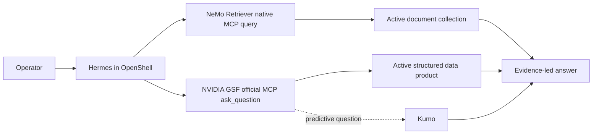

# Query Claw

| Catalog field | Value |
| --- | --- |
| Description | Routes enterprise questions through structured facts, retrieved documents, and predictive analytics, then returns one evidence-led answer from Hermes inside OpenShell. |
| Industry | 🏭 Manufacturing |
| Requirements | Linux Docker host · Docker Compose 2.24.4+ · Bash · curl · Python 3.10+ · NVIDIA inference access · Kumo API access for prediction · clean pinned GSF integration checkout |
| NemoClaw | v0.0.123 |
| Harness | Hermes 0.20.6 |
| OpenShell | 0.0.106 |
| Reviewed | 2026-09-10 |

Query Claw is an NVIDIA-authored reference recipe for analysts and developers
who need one agent to investigate governed records, unstructured documents,
and predicted outcomes. Hermes plans inside OpenShell and can answer through
exactly three data paths:

- **Unstructured retrieval:** NeMo Retriever's native `query` tool.
- **Structured retrieval:** NVIDIA Ontology/GSF's official `ask_question` tool.
- **Structured prediction:** the same GSF `ask_question` tool. Returned `sql`
  starting with `PREDICT` proves GSF attempted Kumo; finite numeric prediction
  scores are also required before Query Claw treats that attempt as successful.

There is no Query Claw data adapter, direct Kumo tool, web-search fallback, or
general code-execution path.

## Screenshot


This sanitized live result shows Hermes using NeMo Retriever and preserving a
source locator. It predates the current official GSF MCP route, so it is not
evidence that the complete current stack has been live-qualified.

## At A Glance

| Question | Answer |
| --- | --- |
| Category | NVIDIA Recipe |
| Contributor or provenance | NVIDIA |
| Use this when | An enterprise question needs structured facts, document evidence, a prediction, or a deliberate combination of them. |
| You will get | A concise answer that distinguishes observations, retrieved evidence, predictions, and recommendations. |
| Runs on | A Linux Docker host capable of running NemoClaw with Docker Compose 2.24.4+. The deployment uses the released Retriever image on amd64 and builds its pinned CPU service target on arm64. |
| Requires | NVIDIA inference and embedding access, a Kumo API endpoint supported by the pinned GSF integration for predictive datasets, and a clean checkout of that exact GSF revision. |
| Verified on | Credential-free checks on macOS 26.6.2 arm64 with Python 3.14.6; structured retrieval live-qualified through Hermes, OpenShell, and official GSF on a Brev CPU host. |
| Evidence level | local/static checks plus live suite execution |
| Support and maturity | Reference recipe with [best-effort community support](../../../../SUPPORT.md). |
| External access, data, and actions | Prompts and selected evidence reach the configured inference provider. Documents reach the configured embedding and reranking services. Structured questions reach GSF and may reach Kumo. GSF may persist conversation turns. Provider costs and data policies apply. |
| Start here | [Run the local check or deploy the stack](#quickstart). |
| Confirm success | [Run the documented verification](#verification). |

## Architecture



NemoClaw v0.0.123 at commit
`f75f722bb4a1ec9642c8df36c8924e24500d78f0` supplies stock Hermes 0.20.6
and OpenShell 0.0.106. Query Claw does not patch Hermes, build a custom Hermes
image, or install a separate relay connector.

The deployment builds GSF's official OAuth MCP package from its pinned,
reviewed integration checkout. It runs NeMo Retriever 26.08.1 and authorizes
only the native `query` MCP tool for Hermes answers. Retriever's other six tools
remain visible to MCP discovery because NemoClaw owns the native registration,
but OpenShell blocks every call to them. Retriever ingestion is deployment-owned: the
service parses, chunks, embeds, and stores each declared document corpus before
Hermes starts. Queries return reranked, source-bearing hits. Hermes receives
only a sanitized summary of the deployment-qualified parser, chunker,
embedding model, and reranker so it can describe the active retrieval stack
without calling an administrative tool.

## Skills And Tools

The checked-in layout makes the entire agent-facing surface inspectable:

```text
hermes/
├── profile.py                   # reversible tool-limited Hermes profile
├── skills.py                    # skill ownership and integrity receipts
├── setup.sh                     # native MCP and skill configuration
└── teardown.sh                  # ownership-safe restoration
skills/
├── query-claw/                 # choose and combine evidence paths
├── query-claw-structured/      # governed structured retrieval
├── query-claw-predictive/      # GSF-mediated Kumo prediction
└── retriever-mcp/              # unchanged official Retriever skill
tools/
└── tool-contracts.json         # registration identities and answer routes
```

The official `retriever-mcp` skill is vendored byte-for-byte from
[NVIDIA/NeMo-Retriever at `97241d0e`](https://github.com/NVIDIA/NeMo-Retriever/blob/97241d0e9d9bcead2024bc2260ab8a1178c7d80e/skills/retriever-mcp/SKILL.md)
under its Apache-2.0 license. Query Claw applies only that skill's query
workflow; deployment owns ingestion because native write tools are disabled.
The pinned GSF revision contains no upstream agent skill, so the two small
Query Claw GSF skills document its official tool's structured and predictive
contracts.

See the [skill map](skills/README.md) and [tool map](tools/README.md).

### Exact tool boundary

Depending on the active dataset, Hermes receives up to two official MCP
registrations that provide only its supported answer capabilities:

| Capability | Authorized answer tool | Proof |
| --- | --- | --- |
| Unstructured retrieval | `mcp__retriever__query` | Reranked hits from the active collection, including source-bearing metadata. |
| Structured retrieval | `mcp__gsf__ask_question` | Returned SQL and rows from the active semantic data product, where `sql` does not start with `PREDICT`. |
| Structured prediction | `mcp__gsf__ask_question` | Returned `sql` starts with `PREDICT`, with one or more rows that each contain a finite numeric prediction score. |

[`tools/tool-contracts.json`](tools/tool-contracts.json) is the machine-checked
registration and answer-route contract. Query Claw authorizes only GSF
`ask_question` and Retriever `query` for answers from the two official
registrations.

NemoClaw manages Retriever's bearer, private-target policy, registration, and
lifecycle. GSF uses its official per-user OAuth flow. Setup applies a narrow
OpenShell network policy for the private GSF origin and completes OAuth
headlessly inside the sandbox with the generated operator credentials over
standard input. Credentials are not passed in arguments or environment
variables, and credential-bearing output is suppressed.

Tool filtering is not treated as authorization. Service-side read-only
contracts, one-dataset activation, OpenShell policy, private ingress, and the
providers' own authentication remain the security boundaries.

## Datasets And Isolation

Query Claw deploys one active dataset at a time. An external AIQ3 dataset can
provide either or both of these independently:

- a DuckDB database plus reviewed GSF ontology, optionally with Kumo prediction
  artifacts; and
- one document corpus mapped to one NeMo Retriever collection.

Setup copies only the selected manifest's declared outputs into the private,
ignored `.runtime/active-data/` directory. It resets the Query-Claw-owned GSF
catalog when the selected structured dataset changes and rebuilds Retriever's
collection when its activation fingerprint changes. A structured-only dataset
does not expose Retriever. A document-only dataset does not expose GSF or Kumo.
Missing capabilities are not simulated.

The bundled synthetic supply-chain scenario remains a one-command sample and
uses the same singular activation contract as external datasets. For the
cross-industry evaluation workflow, see
[Dataset activation and isolation](docs/dataset-activation.md).
Use separate deployments when audiences require different data visibility;
prompt instructions are not an isolation boundary.

## Quickstart

Start with the credential-free local check:

```bash
git clone https://github.com/NVIDIA/nemoclaw-community.git
cd nemoclaw-community/examples/recipes/nvidia/query-claw
python3 scripts/verify.py --local
```

The full deployment targets one Linux Docker host, including a Brev instance.
Before deployment:

1. Place a clean checkout of the reviewed
   [Query Claw GSF integration](https://github.com/pastorsj/GSF) at the exact
   `QUERY_CLAW_GSF_COMMIT` in `deploy/lib/common.sh` on the host.
2. Provision the Kumo API endpoint supported by that pinned GSF revision if the
   active dataset has predictive data. Query Claw connects to that service; it
   does not create a Kumo account, project, model, or endpoint.
3. On amd64, authenticate Docker to `nvcr.io` so it can pull the pinned NeMo
   Retriever image.

```bash
docker login nvcr.io --username '$oauthtoken'
mkdir -p .runtime
install -m 600 .env.example .runtime/deploy.env
${EDITOR:-vi} .runtime/deploy.env
```

Set the relevant operator inputs in `.runtime/deploy.env`:

| Variables | Purpose |
| --- | --- |
| `GSF_SOURCE_DIR` | Required clean checkout of the reviewed GSF integration; setup enforces the code-owned commit. |
| `NVIDIA_INFERENCE_API_KEY`, `NVIDIA_BASE_URL`, `LLM_MODEL` | Inference and default embedding route used by the stack. |
| `ONTOLOGY_MODEL` | Optional lower-latency model for GSF text-to-SQL; blank uses `LLM_MODEL`. |
| `NVIDIA_EMBED_INVOKE_URL`, `NVIDIA_EMBED_MODEL`, `NVIDIA_EMBED_MODEL_PROVIDER_PREFIX`, `NVIDIA_RERANK_INVOKE_URL`, `NVIDIA_RERANK_MODEL` | Optional NeMo Retriever overrides; blanks use the live-qualified NVIDIA-hosted defaults. Set the provider prefix only when the selected endpoint requires one. |
| `KUMO_RFM_API_URL`, `KUMO_RFM_API_KEY` | Kumo API origin and optional credential consumed only by GSF. The URL is required only when the dataset declares prediction artifacts. |
| `QUERY_CLAW_DATASET_REPOSITORY`, `QUERY_CLAW_DATASET_MANIFEST` | Optional pair selecting exactly one external AIQ3 dataset. Leave both blank for the bundled sample. |
| `NEMOCLAW_SANDBOX_NAME`, `NEMOCLAW_GATEWAY_PORT`, `NEMOCLAW_DASHBOARD_PORT`, `NEMOCLAW_HERMES_API_PORT` | Optional deployment identity and collision-free host ports. |
| `CHAT_UI_URL` | Optional authenticated HTTPS origin for a remote Hermes dashboard; blank keeps it loopback-only. |

Leave generated passwords and bearer values empty. Setup creates them once,
keeps `.runtime/deploy.env` at mode `0600`, and reuses them on later runs. The
GSF checkout and external dataset remain operator-provided inputs; neither is
copied into this repository.

The sandbox name must be unused or already match NemoClaw v0.0.123, Hermes
0.20.6, and OpenShell 0.0.106. Setup installs NemoClaw only when `nemohermes`
is absent. It refuses to silently replace a different shared CLI or rebuild a
same-name sandbox with another release.

Deploy the stack:

```bash
bash deploy/setup.sh
```

Setup performs these reviewable stages:

1. It validates and atomically activates one dataset. The bundled sample is
   generated when no external manifest is selected.
2. For structured data, it resets this deployment's GSF catalog, imports the
   reviewed ontology, and loads physical metadata. For predictive data it also
   seeds database-scoped PQL examples and gives GSF the reviewed graph when one
   is present.
3. For documents, it creates one Retriever collection and submits the corpus
   through Retriever's native parse, chunk, embed, and store pipeline.
4. It creates private TLS ingress for the enabled official MCP servers.
5. It creates or validates the Hermes sandbox, applies its reversible profile,
   installs the coordinator plus only the enabled specialist skills, and
   completes GSF OAuth headlessly when GSF is enabled.

Treat setup and dataset changes as a maintenance window: setup deliberately
stops the private MCP ingress and GSF MCP before replacing data, restores them
only after all readiness checks pass, and completes any required Hermes gateway
restart at the end. Do not run chat requests concurrently, and start a new chat
after setup succeeds.

For a reviewed predictive dataset, setup also gives Hermes a bounded summary of
reviewed target names and optional anchor, entity, and population scope. It is
not prediction evidence and contains no PQL, graph, or row data; official GSF
still generates and executes the request.

Setup refreshes Query Claw's dedicated data services. Do not point this recipe
at a shared or production database. It sends prompts and selected evidence to
the configured inference provider, documents to the configured embedding and
reranking services, and predictive requests selected by GSF to Kumo. Review
each provider's access, retention, residency, license, and cost terms first.

Inspect the deployment without printing credentials:

```bash
bash deploy/status.sh
```

Then use the stock Hermes dashboard or Responses API. Query Claw adds no booth
UI and no in-chat database selector. Try:

```text
Which supplier should operations prioritize when in-transit order exposure,
late-delivery risk, and available contract remedies are considered together?
```

You may constrain a question to records, documents, predictions, or an explicit
combination. Query Claw uses only capabilities present in the active dataset.

## Access On Brev

User surfaces bind to loopback by default. Forward only the surface you need:

```bash
brev port-forward <instance> --host -p 18789:18789  # Hermes dashboard
brev port-forward <instance> --host -p 8642:8642    # Hermes Responses API
```

Get the authenticated dashboard URL on the host:

```bash
nemohermes "${NEMOCLAW_SANDBOX_NAME:-query-claw}" dashboard-url --quiet
```

For an authenticated Brev route, set `CHAT_UI_URL` to the exact external HTTPS
origin before onboarding. The deployment keeps Hermes loopback-bound and
configures the expected Host value; changing it later requires a new sandbox.

The Responses API is at `http://127.0.0.1:8642/v1`. Obtain its bearer only in a
trusted host shell:

```bash
nemohermes "${NEMOCLAW_SANDBOX_NAME:-query-claw}" gateway-token --quiet
```

The other service surfaces are operator diagnostics or agent-only routes:

| Port or route | Binding | Purpose |
| --- | --- | --- |
| `3000` | Host loopback | GSF UI and OAuth/API frontend diagnostics. |
| `3001` | Host loopback | GSF backend diagnostics. |
| `7670` | Host loopback | Authenticated Retriever service diagnostics. |
| `https://<private-host>:9443/mcp` | Host private address | Native NeMo Retriever MCP. |
| `https://<private-host>:9444/mcp` | Host private address | Official GSF MCP on the shared private GSF UI/API/OAuth origin. |
| `3002`, `3003`, `5432`, `7671` | Container network only | GSF ingestion, GSF MCP, PostgreSQL/pgvector, and Retriever vector storage. |
| `8080` by default | Host loopback and sandbox bridge | OpenShell gateway. |

Do not publish `.runtime/deploy.env`, the generated private CA, the MCP ingress,
or unauthenticated access to the dashboard or API.

## Verification

**Evidence level:** local/static checks plus live suite execution.

Run all credential-free checks:

```bash
python3 scripts/verify.py --local
python3 -m unittest discover -s tests -p 'test_*.py'
bash tests/test_lifecycle.sh
bash tests/test_deploy_lifecycle.sh
find deploy hermes tests -type f \
  \( -name '*.sh' -o -path '*/fixtures/bin/*' \) -exec bash -n {} +
```

**Expected result:** every command exits successfully; local verification ends
with `Query Claw local verification: 6/6 checks passed`.

These checks prove deterministic fixture generation, withheld-label isolation,
tool and skill contracts, exact official Retriever skill provenance,
one-dataset activation, reversible Hermes configuration, collision refusal,
and teardown-safe command behavior. They do not exercise a live model, GSF,
Retriever, Kumo, or answer quality.

A deployed stack performs service integration checks during setup. Verify the
managed Retriever bridge when Retriever is enabled:

```bash
python3 scripts/verify.py --live \
  --sandbox "${NEMOCLAW_SANDBOX_NAME:-query-claw}"
```

Run the current AIQ3 questions through Hermes and generate a judged report with
the workflow in [evaluations/README.md](evaluations/README.md). Re-run it when
the model, dataset, or any external service changes; a successful route proves
only the exact configuration exercised by that run.

## Teardown

Stop a full deployment:

```bash
bash deploy/teardown.sh
```

Teardown removes Query Claw's owned Retriever registration and skills, narrow
GSF network policy, and reversible Hermes profile, then stops
the Compose services. It retains persistent data, generated files, and the
Hermes sandbox to avoid implicit data loss.

Delete the sandbox only after inspecting its contents and backups:

```bash
nemohermes "${NEMOCLAW_SANDBOX_NAME:-query-claw}" destroy
```

## Known Limitations And Security

- A clean checkout of the reviewed GSF integration at the exact pinned commit
  must already exist. The recipe builds its official MCP package but does not
  vendor or silently update GSF.
- Kumo remains an external API behind GSF. Query Claw mounts a reviewed graph
  only for the active dataset and calls Kumo only from GSF; it does not expose a
  direct Kumo tool to Hermes. Returned `sql` starting with `PREDICT` proves only
  that GSF attempted the route; finite numeric scores are required before
  calling it successful. Query Claw does not provision or train Kumo.
- The released Retriever 26.08.1 image is amd64-only. On arm64, setup validates
  a clean pinned source checkout and builds its CPU service target without the
  image's x86 CUDA installation block.
- One activation exposes at most one structured data product and one document
  collection. Deploy another isolated stack to change that visibility boundary.
- The bundled synthetic sample is a compatibility path, not a general ETL,
  production authorization design, or quality benchmark.
- The private MCP ingress uses a deployment-local CA and RFC1918 binding.
  Production deployments need their own identity, DNS, certificates, network
  controls, observability, backup, and recovery design.
- The local checks validate code and contracts, not answer correctness. Model,
  endpoint, or dataset changes require a fresh live evaluation.

## Layout

```text
query-claw/
├── data/                       # bundled synthetic sample
├── deploy/                     # full-stack setup, status, and teardown
├── docs/                       # dataset activation and isolation contract
├── evaluations/                # AIQ3 compiler, runner, judge, and report
├── scripts/                    # activation, profile, and verification helpers
├── skills/                     # coordinator and three path-specific skills
├── tools/                      # two-server answer-route contract
└── tests/                      # unit and lifecycle contract tests
```

## Third-Party Services And Support

Except for the attributed official `retriever-mcp` skill, this example vendors
no GSF, NeMo Retriever, Kumo, NemoClaw, OpenShell, Hermes,
PostgreSQL/pgvector, or Caddy source. Deployment uses operator-provided service
access and the pinned components selected by this recipe. Each component keeps
its own access, availability, data-handling, cost, support, and license terms.
See the repository [third-party notices](../../../../THIRD-PARTY-NOTICES) and
[support policy](../../../../SUPPORT.md).
