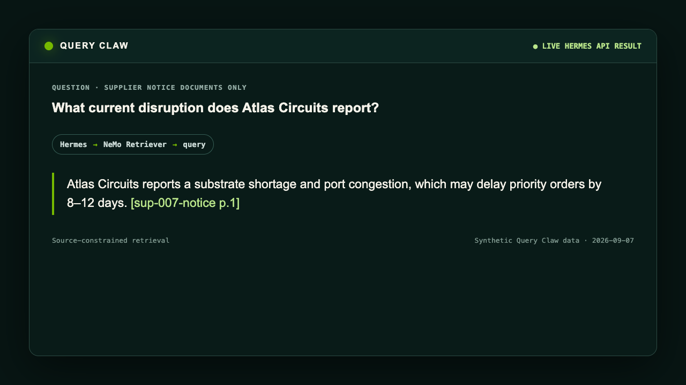
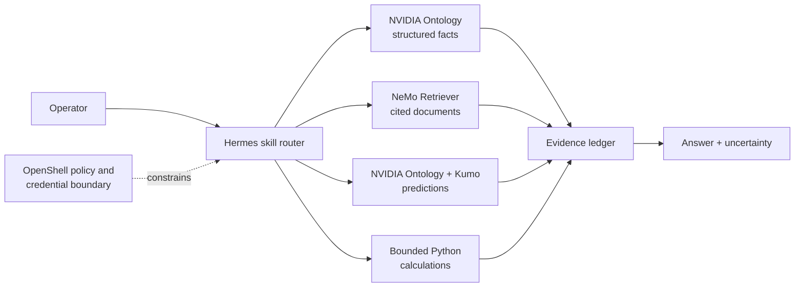

# Query Claw

| Catalog field | Value |
| --- | --- |
| Description | Routes enterprise questions through structured facts, cited documents, predictive analytics, and bounded calculations, then returns one evidence-led answer from Hermes inside OpenShell. |
| Industry | 🏭 Manufacturing |
| Requirements | Linux Docker host · Docker Compose 2.24.4+ · Bash · curl · Python 3.10+ · NVIDIA inference access · compatible Kumo prediction endpoint · licensed NVIDIA Ontology source tree or export |
| NemoClaw | v0.0.120 |
| Harness | Hermes 0.20.6 |
| OpenShell | 0.0.106 |
| Reviewed | 2026-09-07 |

Query Claw is an NVIDIA-authored reference recipe for analysts and developers
who need one agent to investigate structured records, unstructured documents,
and predicted outcomes without blending those evidence types together. Hermes
plans the work inside OpenShell, calls a small bounded toolbox, and labels
observations, predictions, calculations, and recommendations separately.

The deployment scripts generate one synthetic supply-chain data product with
three selectable evidence views—governed records, cited documents, and
predictions. A small data-pack contract can also expose an explicit allowlist
of operator-managed datasets without mounting hidden packs. Setup loads the
built-in database, indexes every selected document collection, qualifies the
configured prediction path, installs the stock Hermes integration, and verifies
the query-only MCP surface through NemoClaw's native MCP lifecycle. Operators
supply licensed NVIDIA Ontology source and credentials; no private source or
secret is committed here.

## Screenshot



This sanitized presentation of a live Hermes API result shows Query Claw
routing a documents-only question through NeMo Retriever and preserving the
synthetic source locator. It omits operator, model, host, and credential details.
The visible answer reports a substrate shortage and port congestion that may
delay priority orders by 8–12 days, cited to `sup-007-notice p.1`.

## At A Glance

| Question | Answer |
| --- | --- |
| Category | NVIDIA Recipe |
| Contributor or provenance | NVIDIA |
| Use this when | An enterprise question needs structured facts, document evidence, a prediction, or a combination of them. |
| You will get | A concise answer with an evidence ledger, uncertainty, and a bounded next step. |
| Runs on | A Linux Docker host capable of running NemoClaw with Docker Compose 2.24.4+. The deployment handles amd64 and builds Retriever's CPU service target from its pinned source on arm64. |
| Requires | NVIDIA inference and embedding access, a compatible Kumo prediction endpoint, and the tested revision of a licensed NVIDIA Ontology source tree or export. |
| Verified on | Credential-free checks on macOS 26.6.2 arm64 with Python 3.14.6; live Ubuntu 22.04 arm64 Brev qualification on 2026-09-07 with NemoClaw v0.0.120, Hermes 0.20.6, OpenShell 0.0.106, native MCP bridge 1/1, smoke 6/6, and scenarios 6/6. |
| Evidence level | live end-to-end for the included synthetic data and configured external services; the optional semantic judge was not configured for this qualification. |
| Support and maturity | Reference recipe with [best-effort community support](../../../../SUPPORT.md). |
| External access, data, and actions | Prompts and selected evidence reach the configured inference provider; queries and source data reach operator-configured services. NemoClaw injects the Query Claw MCP credential only into its managed adapter. Service costs and data policies apply; no source mutation is intended. |
| Start here | [Run the local check or deploy the full stack](#quickstart). |
| Confirm success | [Compare the expected result](#verification). |

## What This Example Does

Query Claw gives Hermes four explicit routes across selected data products:

- **Structured retrieval:** NVIDIA Ontology answers governed semantic questions
  over enterprise tables.
- **Unstructured retrieval:** NeMo Retriever returns document excerpts with
  source and locator metadata.
- **Predictive analytics:** Kumo ranks or scores future outcomes and explains
  model attribution.
- **Sandboxed analysis:** Python's standard library performs small,
  reproducible calculations over already returned values.

The included manufacturing scenario connects supplier records, purchase
orders, shipment events, and supplier notices with stable synthetic IDs. Ask
for one view explicitly (for example, "use documents only"), combine selected
views, or switch views on a later turn. Query Claw does not invent a new source
when the requested view is unavailable. Evaluation outcomes are generated
under a separate directory so they cannot leak into query-time services.

Five small skills keep that behavior reviewable:

- `query-claw` selects the requested evidence views and coordinates the answer.
- `query-claw-structured`, `query-claw-documents`, and
  `query-claw-predictive` define the three source-specific routes.
- `query-claw-reporting` formats a concise answer, Markdown table or report, or
  text chart while preserving evidence labels and uncertainty.

## Architecture



NemoClaw v0.0.120 supplies Hermes 0.20.6 and OpenShell 0.0.106. The recipe
uses that stock integration: it does not build a custom Hermes image, patch Hermes,
or install a separate relay connector. The recipe does build its data services
and query-only MCP facade.

## Tool Boundary

[`config/tool-contracts.json`](config/tool-contracts.json) is the reviewable
facade query surface. Local checks fail when the endpoint implementation differs from
that allowlist, and live checks require the native private bridge to have its
provider, policy, adapter, credential, and DNS pins in place.

| Route | Facade tool names | Boundary |
| --- | --- | --- |
| Inventory | `check_readiness` | Returns only the active datasets and views visible to the caller's short-lived source scope. It never enumerates hidden packs. |
| NVIDIA Ontology | `check_answerable`, `ask_question` | Each call names one active dataset binding. The built-in `query_claw` database uses a transaction-read-only model role, and returned rows are bounded while retaining the full row count. |
| NeMo Retriever | `query` | Each dataset fixes the request to its declared collection and citation-ready retrieval; Retriever 26.08.1's broader service surface is disabled. |
| NVIDIA Ontology + Kumo | `predict` | The facade sends a bounded predictive question to the selected Ontology database, which owns its configured Kumo integration. Hermes never calls Kumo directly or constructs PQL. |
| Python | `execute_code` | The live evaluator accepts only numeric-scalar arithmetic with one printed result and grants one non-persistent approval. |
| Skills | `skills_list`, `skill_view`, `skill_manage` | NemoClaw installs the five namespaced Query Claw skills natively. Hermes must load matching skills with `skill_view`; any `skill_manage` write is scanned and staged for explicit operator approval. |

Tool filtering is not treated as authorization. One facade exposes only the
five Query Claw tools above, uses one bearer credential, and sits behind a private
TLS ingress. One native NemoClaw registration manages the provider, policy,
credential, and Hermes adapter for that external facade. Its
v0.0.120 `tools/list` diagnostic does not run for explicitly trusted private
hostnames, so setup accepts only that exact diagnostic skip after every native
bridge check succeeds; the live evaluator then requires real routed calls.

NemoClaw's native `mcp add`, `mcp restart`, `mcp status`, and `mcp remove`
commands own registration, credential injection, reconciliation, status, and
removal. The recipe installs the five checked-in skills with NemoClaw's
native skill lifecycle. Its reversible Hermes profile enables skill-write
approval and agent-authored skill scanning, then exposes only
`code_execution`, native skill tools, and the named Query Claw MCP server; it
excludes every other built-in or globally registered MCP server.
Facade upstream calls stop before Hermes's native MCP deadline so the agent
receives a bounded error instead of tripping its server circuit breaker.
The evaluator's numeric-AST
check and agent instructions are not runtime authorization: dashboard
operators must inspect and deny broader code approvals. OpenShell policy and
the endpoint-side query contracts remain the authorization boundary.

## Quickstart

Start with the credential-free local check:

```bash
git clone https://github.com/NVIDIA/nemoclaw-community.git
cd nemoclaw-community/examples/recipes/nvidia/query-claw
python3 scripts/verify.py --local
```

The full deployment targets one Linux Docker host, including a Brev instance,
but the public repository is not a self-contained installer. Before deploying:

- Obtain the licensed NVIDIA Ontology source through an authorized NVIDIA
  distribution or support channel and place its tested revision on the host.
  This recipe cannot grant or validate that entitlement. A source export can
  instead carry its exact revision in `SOURCE_COMMIT`.
- Provision a compatible KumoRFM environment and obtain its direct API URL and
  API key. The recipe connects to that existing service; it does not create an
  account, project, model, or endpoint.
- On amd64, authenticate Docker to `nvcr.io` with an NGC account and API key so
  Docker can pull the pinned NeMo Retriever image:

  ```bash
  docker login nvcr.io --username '$oauthtoken'
  ```

The licensed Ontology source and all credentials are operator-provided inputs;
the recipe does not clone, copy, or commit them. It may clone NeMo Retriever's
public pinned source when building its arm64 image. Without the required
entitlements and services, the credential-free local verification remains
available but the full deployment cannot complete.

Create the owner-readable deployment environment:

```bash
mkdir -p .runtime
install -m 600 .env.example .runtime/deploy.env
${EDITOR:-vi} .runtime/deploy.env
```

Set these operator inputs in `.runtime/deploy.env`:

| Variables | Purpose |
| --- | --- |
| `GSF_SOURCE_DIR`, `GSF_SOURCE_REVISION` | Licensed NVIDIA Ontology source tree or export and its exact tested revision. |
| `NEMO_RETRIEVER_SOURCE_DIR` | Optional clean checkout/cache; blank uses `.runtime/sources/nemo-retriever`. |
| `NVIDIA_INFERENCE_API_KEY`, `NVIDIA_BASE_URL`, `LLM_MODEL` | Compatible inference and embedding route. |
| `ONTOLOGY_MODEL` | Optional lower-latency Ontology text-to-SQL model; blank uses `LLM_MODEL`. |
| `KUMO_RFM_API_URL`, `KUMO_RFM_API_KEY` | Direct compatible Kumo API and optional credential; websites, redirects, and project-management APIs are incompatible. |
| `QUERY_CLAW_DATASETS`, `QUERY_CLAW_PACKS_ROOT` | Startup allowlist and optional operator-managed pack registry. The default selects only the built-in `supply-chain` pack. |
| `NEMOCLAW_SANDBOX_NAME`, `NEMOCLAW_GATEWAY_PORT`, `NEMOCLAW_DASHBOARD_PORT`, `NEMOCLAW_HERMES_API_PORT` | Optional deployment name and collision-free host ports; defaults are `query-claw`, `8080`, `18789`, and `8642`. |
| `CHAT_UI_URL` | Optional authenticated dashboard origin; on Brev, use the hostname assigned to the configured dashboard port before onboarding. |
| `QUERY_CLAW_JUDGE_BASE_URL`, `QUERY_CLAW_JUDGE_MODEL`, `QUERY_CLAW_JUDGE_API_KEY` | Optional semantic judge used only with `--judge`. |

Leave generated passwords and MCP bearer values empty. Setup creates them once,
keeps the file at mode `0600`, and reuses them on later runs. The detected
private hostname must resolve to the detected RFC1918 address on the host so
OpenShell can verify the private MCP certificate.

The sandbox name must be unused or already identify the exact Query Claw stack.
Setup refuses to rebuild a same-name sandbox with a different agent or release;
choose another name or inspect and explicitly rebuild that sandbox yourself.
Setup installs NemoClaw v0.0.120 only when `nemohermes` is absent. It never
silently replaces an existing user-local CLI: if another version is already on
`PATH`, explicitly upgrade, downgrade, or activate v0.0.120, confirm it with
`nemohermes --version`, and rerun setup.

Run the single deployment orchestrator:

Rerunning setup refreshes the dedicated synthetic environment: it drops and
recreates Query Claw's six PostgreSQL tables, clears and recompiles its
semantic layer, and may rebuild the Retriever index. Do not point this recipe
at a shared or production database. Running setup also accepts NemoClaw's
documented third-party software terms non-interactively.

```bash
bash deploy/setup.sh
```

It runs five reviewable stages in order:

1. `setup-gsf.sh` builds NVIDIA Ontology, loads PostgreSQL, catalogs the six
   synthetic tables in Neo4j, and completes semantic compilation.
2. `setup-retriever.sh` starts NeMo Retriever 26.08.1, creates each active
   document collection, ingests its declared files, and verifies retrieval. On
   arm64 it builds the pinned CPU service target from source because the
   released container is amd64-only.
3. `setup-kumo.sh` qualifies every active prediction binding through NVIDIA
   Ontology, then starts the five-tool facade. It does not provision or train
   Kumo, and it does not expose a direct Kumo tool.
4. `setup-ingress.sh` creates a private, locally trusted TLS ingress for the
   Query Claw MCP server.
5. `setup-hermes.sh` installs NemoClaw v0.0.120 when the CLI is absent or
   confirms that exact existing version, creates the Hermes sandbox in
   OpenShell, registers and reconciles that server through native MCP
   commands, installs five focused skills, applies the narrow API profile, and
   lets NemoClaw create or recover its native dashboard and API host forwards.

Setup sends prompts and selected evidence to the configured inference provider
and documents to the configured embedding service. NVIDIA Ontology sends
prediction requests to the configured Kumo endpoint. Review
each provider's access, retention, residency, license, and cost terms first. Do
not publish `.runtime/deploy.env`, the generated CA, the Hermes dashboard, or
the MCP ingress.

Inspect the deployment without printing its credentials:

```bash
bash deploy/status.sh
```

Query Claw does not add a separate booth UI or database selector: ask for a
visible dataset and its records, documents, predictions, or an explicit
combination in natural language. The coordinator skill delegates only to the
matching specialist skills. With multiple datasets, a trusted caller creates a
short-lived source scope for each turn; unscoped calls fail rather than falling
back to another dataset. The stock dashboard is intended for one dataset
selected at startup; use the evaluator or another trusted API controller for
per-turn multi-dataset selection. Try:

```text
Which supplier should operations prioritize when in-transit order exposure,
late-delivery risk, and available contract remedies are considered together?
```

You can also ask "What can you do?" without querying a source, or constrain a
turn with language such as "Use supplier notices only." Supported response
shapes are a concise answer, Markdown table, short Markdown report, or text
chart. Generated HTML, SVG, and PowerPoint artifacts are intentionally deferred
until a concrete output workflow justifies those permissions.

## Access on Brev

By default, the user surfaces bind to loopback on the Brev host. Forward only
the surface you need, keep each command running in its own terminal, and
replace `<instance>` with your Brev instance name:

```bash
brev port-forward <instance> --host -p 18789:18789  # Hermes dashboard
brev port-forward <instance> --host -p 3000:3000    # NVIDIA Ontology UI
brev port-forward <instance> --host -p 8642:8642    # Hermes API
brev port-forward <instance> --host -p 3001:3001    # optional Ontology API docs
brev port-forward <instance> --host -p 7670:7670    # optional authenticated Retriever diagnostics
```

Obtain the exact authenticated dashboard URL on the Brev host:

```bash
nemohermes "${NEMOCLAW_SANDBOX_NAME:-query-claw}" dashboard-url --quiet
```

After forwarding port `18789`, open its loopback URL. Forward port `3000` and
open `http://127.0.0.1:3000` to inspect Ontology separately. Its operator login
is in the mode-`0600` `.runtime/deploy.env`; inspect it only in a trusted shell.

For an authenticated Brev public route, set `CHAT_UI_URL` to the exact HTTPS
origin before initial onboarding, for example
`https://<hostname>.brevlab.com`. NemoClaw keeps Hermes loopback-bound
and records that hostname with its host-forward port in the startup profile so
the dashboard's Host validation accepts the reverse proxy. The browser still
uses the port-free Brev origin. Changing the hostname later requires a new
sandbox; setup fails closed instead of weakening Host validation.

The structured Hermes API is available at `http://127.0.0.1:8642/v1` after
forwarding. Obtain its bearer token on the Brev host without sharing it:

```bash
nemohermes "${NEMOCLAW_SANDBOX_NAME:-query-claw}" gateway-token --quiet
```

Treat the API and dashboard as high-authority operator surfaces and keep them
behind an authenticated Brev tunnel.

### Ports and endpoints

| Port or route | Binding | Purpose | Access |
| --- | --- | --- | --- |
| `18789` | Host loopback | Hermes dashboard and chat UI, forwarded from the OpenShell sandbox | Brev tunnel only |
| `8642` | Host loopback | Hermes structured API at `/v1` | Brev tunnel plus bearer token |
| `3000` | Host loopback | NVIDIA Ontology operator UI | Brev tunnel only |
| `3001` | Host loopback | NVIDIA Ontology API for diagnostics | Brev tunnel only; Hermes uses the adapter instead |
| `7670` | Host loopback | NeMo Retriever REST service for diagnostics | Brev tunnel plus bearer token; health probes are public |
| `9443` | Host private address | TLS ingress for the external Query Claw MCP facade | OpenShell and host-private traffic only |
| `8000` | Compose network only | Query-only Ontology, Retriever, and Kumo MCP facade | Through port `9443` only |
| `3002` | Compose network only | NVIDIA Ontology ingestion and semantic-compilation service | Internal only |
| `5432` | Compose network only | PostgreSQL source data | Internal only |
| `7474`, `7687` | Compose network only | Neo4j catalog and semantic graph | Internal only |
| `7671` | Retriever container only | Retriever's supervised vector database | Internal only |
| `8080` by default | Host loopback and sandbox bridge | OpenShell gateway; override with `NEMOCLAW_GATEWAY_PORT` | Local NemoClaw CLI and its sandbox only |

The managed MCP URLs use the private hostname selected during setup:

```text
https://<private-host>:9443/mcp/
```

Keep the trailing slash. The generated private CA is passed to NemoClaw during
onboarding, and the endpoint uses one generated bearer credential.

## Data Packs

`data/supply-chain.json` is the small, authored scenario. The generator writes
ignored runtime files with a fixed seed and cutoff:

```text
.runtime/data/
├── service/
│   ├── documents/              # supplier notices for Retriever
│   └── structured/             # CSV tables for Ontology and Kumo
├── evaluation/
│   └── labels.csv              # withheld future outcomes
└── manifest.json               # counts, hashes, dates, fingerprint
```

All names and records are synthetic. The pack contains 1,500 completed
historical orders whose observed outcomes span through the prediction cutoff,
24 open evaluation orders, 10 suppliers, 5 facilities, and 8 products.
The generator validates primary keys, foreign keys, file hashes, document IDs,
the prediction cutoff, and label separation. The six structured tables keep
timestamped historical outcomes in `delivery_outcomes.csv`; future outcomes
for the 24 open evaluation orders remain only in `evaluation/labels.csv` and
never enter the service graph. Kumo excludes the service-only prediction split
and cutoff status from its model graph, then anchors predictions to the manifest
cutoff with a `(0, 30, DAYS)` horizon.

Additional datasets use one `pack.json` that declares an ID, industry,
available views, and service-owned Ontology database or Retriever collection
bindings. Predictive packs also declare one stable setup probe that must return
Kumo rows and a graph receipt for that exact database. `QUERY_CLAW_DATASETS`
selects the startup allowlist. Materialization
copies only those packs into the read-only active tree, so an unselected pack is
not mounted or discoverable. The one-command deployment supports the built-in
structured/predictive pack plus supplemental document-only packs; operators can
use the same manifest with separately provisioned Ontology databases for other
structured or predictive packs. See [Data packs](docs/data-packs.md) for the
small schema, loading boundary, and per-turn source scopes.

## Verification

**Local evidence level:** local/static.

Run all credential-free example checks:

```bash
python3 scripts/verify.py --local
python3 -m unittest discover -s tests -v
bash tests/test_lifecycle.sh
bash tests/test_deploy_lifecycle.sh
bash -n scripts/*.sh deploy/*.sh deploy/lib/*.sh tests/*.sh tests/fixtures/bin/*
```

**Expected result:**

```text
PASS deterministic data  744428eb2c41cef4
PASS service boundary    16 service files; labels held separately
PASS entity integrity    1524 orders; 10 supplier notices
PASS temporal boundary   24 prediction labels withheld after cutoff
PASS tool contracts      3 contract-bounded routes
PASS routing skills      5 focused skills; one shared evidence contract
Query Claw local verification: 6/6 checks passed
Ran 81 tests ... OK
PASS: Query Claw native lifecycle command contracts
PASS: Query Claw deployment release contracts
```

This verifies deterministic fixtures, label isolation, entity and date
integrity, skill compilation, exact enabled-tool contracts, idempotent owned
registrations, reversible profile changes, collision refusal, scoped teardown,
and secret-safe logging. It does not exercise a live model or data service.

The full deployment performs integration checks while it loads the structured
database, completes semantic compilation, ingests Retriever documents, probes
the query-only facade through private TLS, and creates one native managed-MCP
registration for that facade. Re-run the authenticated native-bridge check at
any time:

```bash
python3 scripts/verify.py --live \
  --sandbox "${NEMOCLAW_SANDBOX_NAME:-query-claw}"
```

Then run the public smoke suite through Hermes' structured API. The evaluator
prints only case names, timing, and tool names—not prompts, evidence,
reasoning, or answers—and writes a private result receipt:

```bash
API_SERVER_KEY="$(nemohermes "${NEMOCLAW_SANDBOX_NAME:-query-claw}" gateway-token --quiet)" \
  python3 scripts/evaluate_live.py \
    --suite evaluations/smoke.json \
    --output ".runtime/evaluations/smoke-$(date -u +%Y%m%dT%H%M%SZ).jsonl"
```

This credentialed gate has six cases covering structured, document, predictive,
strict-code calculation, hybrid, and abstention behavior. Each isolated session
is deleted after its final status is checked. The evaluator grants only one
non-persistent approval for a statically bounded arithmetic script with one
printed numeric result; repeated calculations, unexpected approvals or tools,
more than one corrective route retry, web fallback, errors, and missing
evidence fail closed.

The latest Brev arm64 qualification on 2026-09-07 passed all six smoke cases
and all six companion scenarios through the stock Hermes 0.20.6 integration.
The optional semantic judge was not configured for that run.

The companion scenarios add a two-turn source switch, capability discovery,
source constraints, report formatting, and optional semantic judging. See
[evaluations/README.md](evaluations/README.md) for commands and receipt privacy.

## Teardown

Stop a full deployment:

```bash
bash deploy/teardown.sh
```

This removes the Query Claw MCP registration and five installed skills
through NemoClaw's native lifecycle, restores the prior Hermes API profile,
then stops its Compose services.
It retains the persistent database and Retriever volumes, generated data, and
Hermes sandbox so an operator does not lose state implicitly.

If you used only the lower-level MCP registration workflow, remove its owned
registration without stopping services:

```bash
bash scripts/teardown.sh
```

Teardown inspects the named registration before using native `mcp remove`,
uses `skill remove` for the five Query Claw skills, and restores the saved API
profile. Keep `.runtime/` while the retained volumes or sandbox exist: its
deployment state is needed to restore that profile and clean up safely. Delete
the sandbox only when it is not shared:

```bash
nemohermes "${NEMOCLAW_SANDBOX_NAME:-query-claw}" destroy
```

Removing a sandbox is destructive. Inspect its contents and backups before you
confirm that command.

## Known Limitations

- NVIDIA Ontology source is licensed and must already exist on the deployment
  host. The recipe builds that source tree or export but does not fetch, vendor, publish, or
  validate an operator's entitlement to it; obtain access through an authorized
  NVIDIA distribution or support channel.
- The pinned, booth-tested Ontology revision includes governed prediction-graph
  receipts but has not yet landed on `NVIDIA/GSF` main. A public release must
  replace this development revision with the corresponding upstream commit.
- The released NeMo Retriever 26.08.1 container is amd64-only. On arm64, setup
  requires a clean pinned source commit, labels the resulting image with that
  revision, and removes its x86 CUDA installation
  block before building the CPU service target; that path does not provide
  local GPU inference. The amd64 path additionally requires NGC registry access
  for the pinned `nvcr.io` image.
- Kumo remains an external prediction service. NVIDIA Ontology must complete a
  real prediction through it during setup. The recipe does not provision a
  project, train a model, or manage the endpoint lifecycle.
- The generated PostgreSQL data, Ontology catalog, Retriever index, and Kumo
  entity population form a synthetic reference scenario. They are not a
  production data migration, authorization model, or quality benchmark.
- The one-command loader remains intentionally specific to the built-in
  supply-chain database. It can ingest supplemental document-only packs, but
  another structured or predictive pack requires a separately provisioned and
  compiled Ontology database matching its declared binding.
- A Git NVIDIA Ontology checkout must be clean and at the declared revision. A
  source export can only declare that revision through `SOURCE_COMMIT`; the
  recipe cannot independently prove the export contents.
- The private MCP ingress uses a deployment-local certificate authority and an
  RFC1918 host binding. Production environments need their own private DNS,
  certificate, identity, observability, backup, and network-control design.
- The included UI is the stock Hermes dashboard, with the NVIDIA Ontology UI as
  a separate operator surface. There is no custom booth UI or manual database
  selector in this recipe.
- Local checks validate code and command contracts, not answer quality. The
  included live evaluator verifies tool selection and successful execution,
  while fixture tests—not an LLM judge—verify deterministic source data. Run
  the credentialed suites again for each deployment and model change.
- Model selection and access are supplied by the operator during NemoClaw
  onboarding; the recipe does not benchmark or certify a model.

## Layout

```text
query-claw/
├── config/tool-contracts.json  # exact model-visible MCP inventories
├── data/supply-chain.json      # deterministic synthetic scenario
├── docs/data-packs.md          # dataset and source-scope contract
├── evaluations/                # smoke, scenarios, and private-suite contract
├── deploy/                     # full-stack setup, status, and teardown
├── scripts/                    # data, registration, evaluation, verification
├── skills/                     # coordinator, source, and reporting skills
└── tests/                      # unit and lifecycle command tests
```

## Third-Party Services and Support

This example vendors no NVIDIA Ontology, NeMo Retriever, Kumo, NemoClaw,
OpenShell, Hermes, PostgreSQL/pgvector, Neo4j, Caddy, FastMCP, or `uv` source.
Deployment pins the runtime components selected by the recipe, uses the
operator's compatible licensed Ontology checkout, and connects to
operator-provided NVIDIA inference and
[KumoRFM](https://docs.nvidia.com/sdgm/quick-start/rfm) services. The amd64
Retriever path also requires authenticated access to the
[NGC container registry](https://docs.nvidia.com/ngc/latest/ngc-private-registry-user-guide.html).
Those components and services retain their own access, availability,
data-handling, cost, support, and license terms. See the repository
[third-party notices](../../../../THIRD-PARTY-NOTICES) for the public source,
service, container, and screenshot references used by this recipe. NemoClaw
installation explicitly accepts its documented third-party software terms.
Catalog placement does not create a separate product support commitment; see
the repository [support policy](../../../../SUPPORT.md).
